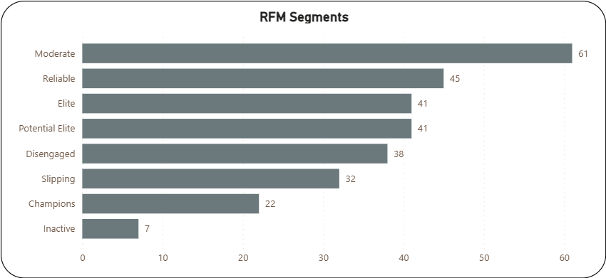
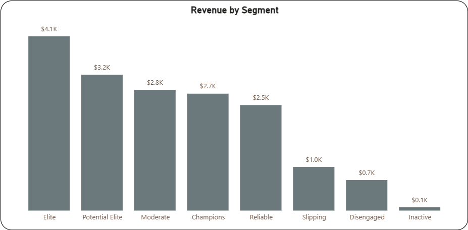

# Customer RFM-Analysis
## Project Overview

The goal of this project is to analyze customer purchasing behavior using **RFM (Recency, Frequency, Monetary) segmentation** in order to identify high-value customers, detect churn risk, and uncover opportunities to increase revenue through targeted marketing strategies.

---
## Table of Contents

- [Project Overview](#project-overview)
- [Executive Summary](#executive-summary)
- [Data Structure & Schema](#data-structure--schema)
- [Segment Definitions](#segment-definitions)
- [Analysis Process](#analysis-process)
  - [RFM Segment Distribution](#rfm-segment-distribution)
  - [Revenue by Segment](#revenue-by-segment)
  - [Segment Focus Area](#segment-focus-area)
  - [Overall Insights](#overall-insights)
- [Business Recommendations](#business-recommendations)
  - [Avoid One-Size-Fits-All Marketing](#avoid-one-size-fits-all-marketing)
  - [Segment-Specific Strategies](#segment-specific-strategies)
  - [Key Strategic Priorities](#key-strategic-priorities)
  - [Recommended Next Steps for Analysis](#recommended-next-steps-for-analysis)
- [Project Resources](#project-resources)
---

## Executive Summary

The analysis shows that the majority of customers fall within mid-tier segments (**Moderate** and **Reliable**), while a smaller group of high-value customers (**Elite** and **Champions**) drives a disproportionate share of revenue. Additionally, **Potential Elite customers underperform relative to Elite customers despite equal population size**, indicating a key opportunity for growth.

These findings matter because they highlight that revenue growth can be achieved more efficiently by **moving existing customers up the value chain** rather than relying solely on new customer acquisition.

Based on these insights, we recommend:
- Prioritizing **conversion of Potential Elite customers into Elite/Champions**
- Implementing **segment-specific marketing strategies** instead of a one-size-fits-all approach
- Investing in **retention of high-value customers** and **re-engagement of at-risk segments**

Together, these actions support a more targeted, data-driven strategy to improve customer lifetime value and overall business performance.

The final output is an interactive dashboard (Power BI) supported by a structured data model and clear analytical framework designed to inform marketing and retention decisions.

## Data Structure & Schema

We transformed raw monthly sales data from 2025 containing the following fields:

- `OrderID`
- `CustomerID`
- `OrderDate`
- `ProductType`
- `OrderValue`

into a refined schema to support **RFM analysis**.

---

## Final Output Table: `rfm_segments_final`

| Field Name         | Business Description                                                                 |
|-------------------|-------------------------------------------------------------------------------------|
| `CustomerID`      | Unique identifier for each individual customer                                      |
| `recency`         | Number of days since the customer's last purchase                                   |
| `frequency`       | Total count of orders placed during the 2025 calendar year                          |
| `monetary`        | Total gross revenue (USD) generated by the customer                                 |
| `r_score`         | 1–10 decile ranking based on Recency (10 = most recent)                             |
| `f_score`         | 1–10 decile ranking based on Frequency (10 = most frequent)                         |
| `m_score`         | 1–10 decile ranking based on Monetary value (10 = highest spend)                    |
| `rfm_total_score` | Combined score (R + F + M) used to determine overall customer value                 |
| `rfm_segment`     | Strategic category assigned based on the aggregate total score                      |

---

## Segment Definitions

To drive targeted marketing and retention strategies, customers are categorized into eight tiers based on their **RFM Total Score**:

| Segment            | Score Range | Description                                                                 |
|--------------------|------------|-----------------------------------------------------------------------------|
| Champions          | 28+        | Highest value customers; recent, frequent, and high-spending                |
| Elite              | 24–27      | Highly loyal and consistent customers                                       |
| Potential Elite    | 20–23      | High-potential customers showing strong growth                              |
| Reliable           | 16–19      | Steady, mid-tier customers with regular engagement                          |
| Moderate           | 12–15      | Occasional shoppers who may benefit from re-engagement                      |
| Slipping           | 8–11       | At-risk customers who haven't purchased recently                            |
| Disengaged         | 4–7        | Low engagement across all metrics                                           |
| Inactive           | <4         | Customers with minimal historical activity                                  |
    
## Analysis Process

### RFM Segment Distribution

The RFM Segments visualization highlights the distribution of customers across each behavioral category, providing an immediate view of overall customer engagement.

The largest segment is **Moderate**, followed by **Reliable**, **Elite**, and **Potential Elite**, indicating that most customers fall within mid-tier engagement levels. These customers show consistent activity but are not yet fully optimized in value.

The **Champions** segment is comparatively small, suggesting an opportunity to further cultivate high-value behaviors. Meanwhile, **Slipping**, **Disengaged**, and **Inactive** segments represent at-risk customers who may require re-engagement strategies.

Overall, the distribution reveals:
- A strong base of **convertible mid-tier customers**
- A **limited top-tier segment** with high value
- A **notable churn-risk population**

---

### Revenue by Segment

The revenue distribution across segments reveals an important dynamic: while **Elite** customers generate the highest total revenue, **Champions** do not lead in overall contribution despite being the highest-scoring group.

Notably, **Elite customers generate significantly more revenue than Potential Elite customers (~$4.1K vs ~$3.2K) despite having the same number of customers**. This indicates a meaningful gap in customer value between these two adjacent segments.

This suggests that:
- **Elite customers** are more effective at converting engagement into higher spending
- **Potential Elite customers represent a high-impact growth opportunity** if successfully nurtured upward
- Moving customers from **Potential Elite → Elite (and eventually Champions)** could yield disproportionate revenue gains without requiring new customer acquisition

Additionally:
- **Moderate** and **Reliable** segments contribute meaningful revenue due to their size
- Lower-tier segments (**Slipping**, **Disengaged**, **Inactive**) contribute minimal revenue, reinforcing their lower engagement and value

Key takeaway:
Revenue is driven not just by top-tier customers, but by **strategic movement between segments**, especially upgrading high-potential groups.

---

### Segment Focus Area

The Segment Focus Area table identifies the weakest dimension (Recency, Frequency, or Monetary) for each group, providing clear direction for targeted strategies.

Key insights include:
- High-value segments (**Champions**, **Elite**, **Potential Elite**) primarily need improvement in **Recency**, indicating a need to maintain engagement and prevent drop-off
- Mid-tier segments like **Reliable** show opportunities in **Monetary**, suggesting upselling or cross-selling potential
- Lower-tier segments (**Moderate**, **Slipping**, **Disengaged**) require improvements in **Frequency**, meaning they need incentives to purchase more often
- **Inactive** customers show uniformly low scores, requiring broad reactivation efforts

This structured approach ensures that each segment receives **targeted, data-driven interventions** rather than generic marketing.

---

### Overall Insights

Across all visuals, several key themes emerge:

- The customer base is heavily concentrated in **mid-tier segments**, representing the greatest opportunity for growth
- **Top-tier customers are valuable but limited**, making retention critical
- **Potential Elite customers are a key leverage point** for increasing revenue efficiently
- **Churn-risk segments are significant enough** to warrant proactive intervention
- Revenue distribution is influenced by both **customer value and segment size**
- Targeted strategies based on RFM dimensions can effectively move customers up the value chain

Together, these insights form the foundation for a **segmentation-driven growth strategy**, focused on retention, conversion, and reactivation.

---

## Business Recommendations

### Avoid One-Size-Fits-All Marketing

A key takeaway from this analysis is that a **single, uniform marketing strategy is ineffective**. Each segment demonstrates distinct behavioral patterns and requires tailored engagement approaches based on its RFM profile.

---

### Segment-Specific Strategies

**Champions & Elite**
- Focus: **Retention & Recency**
- Strategies:
  - Loyalty programs and exclusive rewards
  - Early access to products or promotions
  - Personalized communication to maintain engagement

**Potential Elite**
- Focus: **Conversion to Elite/Champions**
- Strategies:
  - Targeted upselling and cross-selling
  - Incentives for higher spend thresholds
  - Personalized offers based on past behavior

> This segment represents the **highest ROI opportunity**, as small behavioral improvements can lead to significant revenue gains.

**Reliable**
- Focus: **Increase Monetary Value**
- Strategies:
  - Bundling products or volume discounts
  - Recommendations to increase basket size

**Moderate**
- Focus: **Increase Frequency**
- Strategies:
  - Time-based promotions
  - Reminder campaigns and retargeting

**Slipping & Disengaged**
- Focus: **Re-engagement**
- Strategies:
  - Win-back campaigns
  - Limited-time offers or discounts
  - Email reactivation sequences

**Inactive**
- Focus: **Reactivation or Exit Strategy**
- Strategies:
  - High-incentive offers
  - Surveys to understand churn
  - Consider deprioritization if unresponsive

---

### Key Strategic Priorities

- Prioritize **moving customers upward between segments**, especially:
  - Potential Elite → Elite
  - Moderate → Reliable
- Invest in **retention of high-value segments**
- Actively manage **at-risk customers before churn occurs**
- Align marketing efforts with **specific RFM weaknesses (R, F, or M)**

---

### Recommended Next Steps for Analysis

To further strengthen insights and strategy, additional analysis is recommended:

- **Product Category Analysis**
  - Evaluate how RFM scores vary across different product types
  - Identify which categories drive high-value customer behavior

- **Seasonality Trends**
  - Analyze purchasing behavior across months or quarters
  - Identify peak engagement periods and optimize campaign timing

- **Year-over-Year Comparison**
  - Compare RFM distributions across multiple years
  - Track customer progression, retention, and churn trends over time

- **Customer Lifecycle Analysis**
  - Understand how customers transition between segments over time
  - Identify key triggers that drive movement up or down

These additional analyses will provide a more **holistic understanding of customer behavior**, enabling more precise and effective business strategies.

---
## Project Resources
* **[SQL Scripts](./sql_scripts/)** - Database queries and data transformation logic.
* **[Raw & Processed Data](./data/)** - Source files used for the analysis (to be uploaded).
* **[Power BI Interactive Dashboard](./powerbi_dashboard/)** - The final visual report and deep-dive analysis (to be uploaded).
